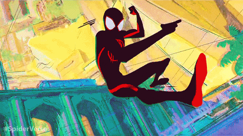

<div align='center'>
  
</div>

<p align="center">
  
</p>

---

## 👾 Hacktoberfest Stats

[](https://holopin.io/@igyahiko)

---

## ⚔️ The Arsenal — My Tech Stack

<div align="center">
  <table>
    <tr>
      <td valign="top" width="50%">
        <div align="center">
          
          <br />
          <em>"Wake up to reality! Nothing ever goes as planned in this cursed world."</em>
        </div>
      </td>
      <td valign="top" width="50%">
        <div align="center">
          <h3>🔥 Frontend Sorcery</h3>
          <p>
            
            
            
            
            
            
            
            
            
          </p>
        </div>
      </td>
    </tr>
  </table>
</div>

<div align="center">
  <table>
    <tr>
      <td valign="top" width="50%">
        <div align="center">
          <h3>⚡ Backend Ninjutsu</h3>
          <p>
            
            
            
            
            
            
            
            
          </p>
        </div>
      </td>
      <td valign="top" width="50%">
        <div align="center">
          
          <br />
          <em>"With great power comes great responsibility... and great code."</em>
        </div>
      </td>
    </tr>
  </table>
</div>

<div align="center">
  <table>
    <tr>
      <td valign="top" width="50%">
        <div align="center">
          
          <br />
          <em>"Anyone can wear the mask. Anyone can write the code."</em>
        </div>
      </td>
      <td valign="top" width="50%">
        <div align="center">
          <h3>🛡️ DevOps & Cloud Jutsu</h3>
          <p>
            
            
            
            
            
            
            
            
          </p>
        </div>
      </td>
    </tr>
  </table>
</div>

<div align="center">
  <table>
    <tr>
      <td valign="top" width="50%">
        <div align="center">
          <h3>🎨 Creative Arsenal</h3>
          <p>
            
            
            
            
            
          </p>
        </div>
      </td>
      <td valign="top" width="50%">
        <div align="center">
          
          <br />
          <em>"Does whatever a spider can... and so can your code!"</em>
        </div>
      </td>
    </tr>
  </table>
</div>

---

## 🎯 Current Missions

<div align="center">
  <table>
    <tr>
      <td align="center">
        
        <br />
        <strong>⚙️ Building Next.js tools</strong>
        <br />
        <em>with Inngest + E2B Sandbox</em>
      </td>
      <td align="center">
        
        <br />
        <strong>🧪 Breaking stuff</strong>
        <br />
        <em>just to fix it (intentionally, of course)</em>
      </td>
      <td align="center">
        
        <br />
        <strong>📱 Mobile Dev</strong>
        <br />
        <em>React Native adventures</em>
      </td>
    </tr>
  </table>
</div>

---

## ⚡ GitHub Stats

<div align="center">
  
  
</div>

<div align="center">
  
</div>

---

## 🐍 Contribution Snake

<div align="center">
  
  <br />
  <em>Even the snake knows: keep moving, keep contributing!</em>
</div>

---

## 🎵 Now Playing on Spotify

## 🎵 Current Vibes

<div align="center">

🎧 **Now playing:** Lo-fi hip hop radio - beats to code/relax to  
🎌 **Anime OST:** Jujutsu Kaisen - "Kaikai Kitan"  
🌙 **Synthwave:** The Midnight - "Los Angeles"  

*Updated frequently while coding* ⚡

[](https://open.spotify.com/user/31rnwysop3skvq2sug3vslm5hy34)

</div>

### 🎧 Current Coding Vibes

```javascript
const devPlaylist = [
  "🎧 Lo-fi Hip Hop - 'Debug Mode.exe'",
  "🎧 Anime Openings - 'Stack Overflow'd'",
  "🎧 Synthwave - 'Git Commit Dreams'",
  "🎧 Epic Orchestral - 'Production Ready'"
];
